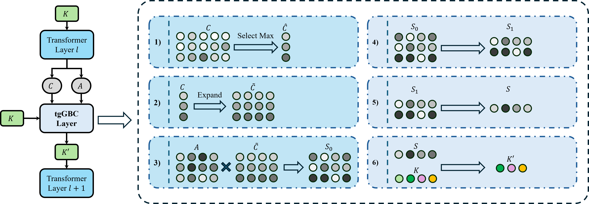

# Accelerate 3D Object Detection Models via Zero-Shot Attention Key Pruning



## Introduction

We propose a zero-shot, retraining-free pruning method that accelerates 3D object detection models via key pruning.

## Get Started

You need `pytorch` to use tgGBC, and prepare any .

```bash
# 1. install your pytorch.
pip3 install torch torchvision torchaudio

# 2. clone this repo.
git clone https://github.com/iseri27/tg_gbc
cd tg_gbc

# 3. install tggbc
python setup.py develop
```

## Examples

### Evaluation

We provide an example of [OPEN](https://github.com/AlmoonYsl/OPEN) in [examples/open](examples/open/README.md) to help you evaluate models with tgGBC.

### Training

We provide an example of [StreamPETR](https://github.com/exiawsh/StreamPETR) in [examples/streampetr](examples/streampetr/README.md) to help you train models with tgGBC. We also provide some checkpoints of StreamPETR-vov-1600x640.

## Citation

```bib
@misc{xu2025tggbc,
      title={Accelerate 3D Object Detection Models via Zero-Shot Attention Key Pruning}, 
      author={Lizhen Xu and Xiuxiu Bai and Xiaojun Jia and Jianwu Fang and Shanmin Pang},
      year={2025},
      eprint={2503.08101},
      archivePrefix={arXiv},
      primaryClass={cs.CV},
      url={https://arxiv.org/abs/2503.08101}, 
}
```