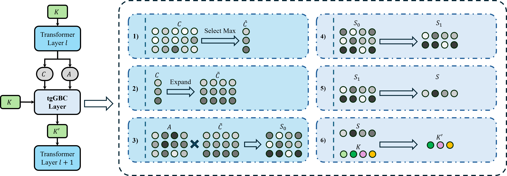

# [ICCV2025] Accelerate 3D Object Detection Models via Zero-Shot Attention Key Pruning

This is the implentation for our paper "[Accelerate 3D Object Detection Models via Zero-Shot Attention Key Pruning](https://arxiv.org/abs/2503.08101)"

[中文版本的 README](README_CN.md)



## Introduction

We propose a zero-shot, retraining-free pruning method that accelerates 3D object detection models via key pruning.

## News

- [2025/06/26]🔥Our paper is accepted by ICCV 2025 🎉🎉🎉.
- [2025/03/11]🔥We release our code and checkpoints.

## Get Started

You need `pytorch` to use tgGBC.

```bash
# 1. install your pytorch.
pip3 install torch torchvision torchaudio

# 2. clone this repo.
git clone https://github.com/iseri27/tg_gbc
cd tg_gbc

# 3. install tggbc
python setup.py develop
```

## Examples

### Evaluation

We provide an example of [OPEN](https://github.com/AlmoonYsl/OPEN) in [examples/open](examples/open/README.md) to help you evaluate models with tgGBC.

### Training

We provide an example of [StreamPETR](https://github.com/exiawsh/StreamPETR) in [examples/streampetr](examples/streampetr/README.md) to help you train models with tgGBC. We also provide some checkpoints of StreamPETR-vov-1600x640.

## Citation

```bib
@InProceedings{xu2025gbc,
    author    = {Xu, Lizhen and Bai, Xiuxiu and Jia, Xiaojun and Fang, Jianwu and Pang, Shanmin},
    title     = {Accelerate 3D Object Detection Models via Zero-Shot Attention Key Pruning},
    booktitle = {Proceedings of the IEEE/CVF International Conference on Computer Vision (ICCV)},
    month     = {October},
    year      = {2025},
    pages     = {23085-23094}
}
```
