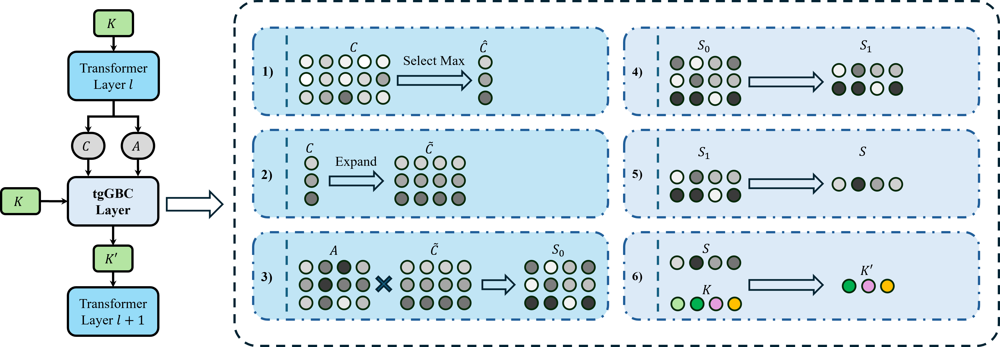

# [ICCV2025] Accelerate 3D Object Detection Models via Zero-Shot Attention Key Pruning

论文 "[Accelerate 3D Object Detection Models via Zero-Shot Attention Key Pruning](https://arxiv.org/abs/2503.08101)" 的代码实现。



## 简介

我们提出了一种零成本、无需重新训练的裁剪方式，通过裁剪key加速3D目标检测模型的推理。

## 最新动态

- [2025/06/26]🔥TgGBC被ICCV 2025接收🎉🎉🎉.
- [2025/03/11]🔥发布代码及模型权重。

## 快速开始

```bash
# 1. install your pytorch.
pip3 install torch torchvision torchaudio

# 2. clone this repo.
git clone https://github.com/iseri27/tg_gbc
cd tg_gbc

# 3. install tggbc
python setup.py develop
```

## 示例

### 测试

见 [examples/open](examples/open/README.md)，我们提供了使用 tgGBC 测试 [OPEN](https://github.com/AlmoonYsl/OPEN) 所需的代码。

### 训练

见 [examples/streampetr](examples/streampetr/README.md)，我们提供了使用 tgGBC 训练[StreamPETR](https://github.com/exiawsh/StreamPETR) 所需的代码。同时，也提供了使用 tgGBC训练得到的 StreamPETR-vov-1600x640 模型权重。

## 引用论文

```bib
@misc{xu2025tggbc,
      title={Accelerate 3D Object Detection Models via Zero-Shot Attention Key Pruning}, 
      author={Lizhen Xu and Xiuxiu Bai and Xiaojun Jia and Jianwu Fang and Shanmin Pang},
      year={2025},
      eprint={2503.08101},
      archivePrefix={arXiv},
      primaryClass={cs.CV},
      url={https://arxiv.org/abs/2503.08101}, 
}
```